# SkillSentry: Skill-Oriented Runtime Assurance for Reliable LLM Agent Execution

SkillSentry is a skill-oriented runtime assurance framework that improves the reliability of LLM agent execution. It wraps around the agent execution loop to monitor and guide skill execution under a structured runtime guidance, and iteratively refines that guidance using newly collected traces.

> Paper: *SkillSentry: Skill-Oriented Runtime Assurance for Reliable LLM Agent Execution*

## Overview

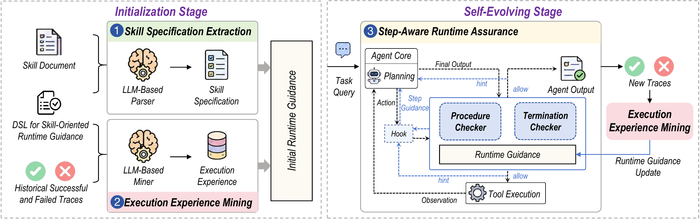

SkillSentry consists of two stages:

**Initialization Stage**
1. **Skill Specification Extraction** — An LLM-based parser reads the skill document (SKILL.md) and extracts a structured skill specification: expected steps, step dependencies, constraints, and completion requirements. This is encoded in a domain-specific language (DSL) designed for skill-oriented runtime guidance.
2. **Execution Experience Mining** — An LLM-based miner analyzes historical successful and failed traces to extract validated action patterns, failure-associated actions, and step-level suggestions and warnings. The extracted experience is merged with the skill specification to produce the initial runtime guidance.

**Self-Evolving Stage**

3. **Step-Aware Runtime Assurance** — The agent executes new task queries under the current runtime guidance. A hook intercepts each planned action and passes it to:
   - **Procedure Checker**: monitors whether execution follows the skill procedure; delivers step-level hints and blocks failure-associated actions when detected.
   - **Termination Checker**: verifies that all required skill steps have been completed before accepting the final output; prompts the agent to continue if not.

   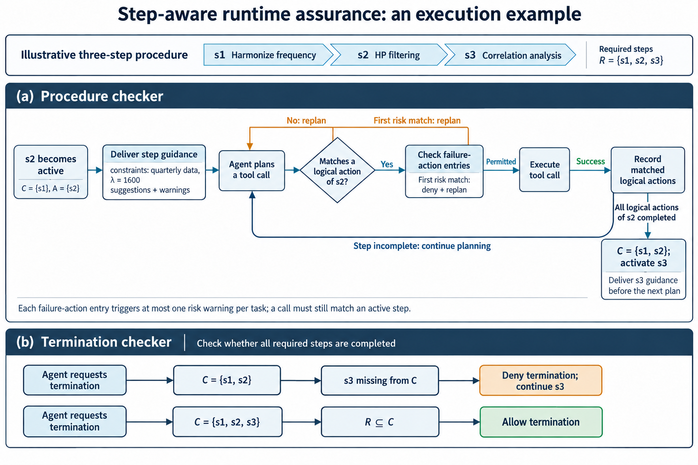

   Resulting successful and failed traces are collected and fed back into Execution Experience Mining to update the runtime guidance, forming a self-evolving loop.

## Motivating Example

The skill *macroeconomic-timeseries-detrending* defines a six-step procedure. Even when this skill is loaded, LLM agents still fail in two typical ways. In **step deviation**, a required step such as *Harmonize Frequency* is skipped. In **incorrect step execution**, a step is carried out with the wrong parameter, for example an HP-filter λ of 100 instead of 1600 for quarterly data.

| Skill | Failure cases |
|---|---|
| 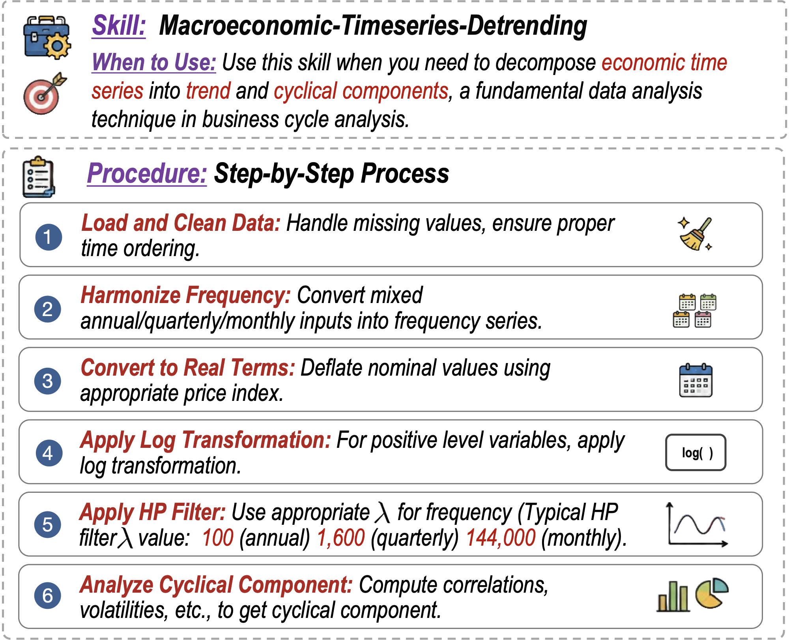 | 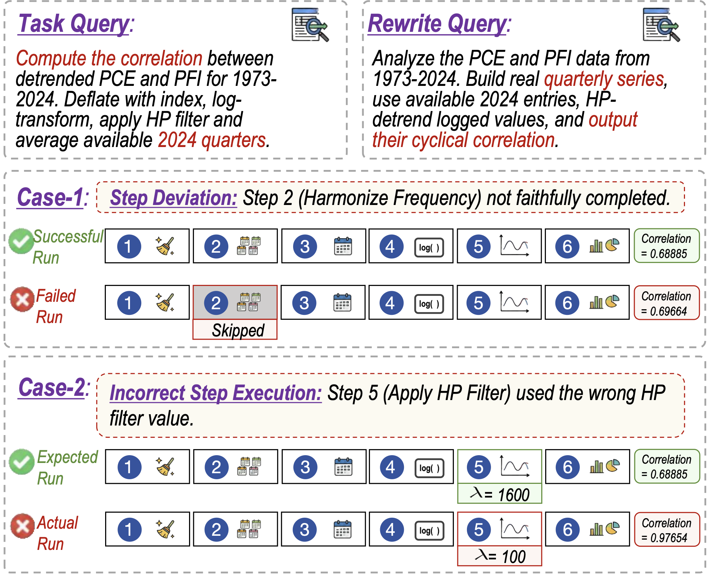 |

## Repository Structure

```
skillsentry/
├── LICENSE
├── README.md
│
├── assert/
│   ├── overview.pdf / .png           # Architecture overview figure
│   ├── runtime_assurance_example.png # Step-aware runtime assurance execution example
│   ├── example_skill.png             # Motivating example: the detrending skill
│   ├── example_failure_cases.png     # Motivating example: step deviation / incorrect step execution
│   ├── example_runtime_guidance.png  # Structure of the runtime guidance for the example skill
│   └── case_study_runtime_assurance.png  # Case study: SkillSentry assuring Claude Code + Haiku-4.5
│
├── data/
│   ├── raw/
│   │   └── skillsentry_tasks/        # Raw task environments, 15 tasks
│   │       └── <task>/
│   │           └── <task>_0 … <task>_15/          # 16 task-level variants per task
│   │               ├── instruction.md             #   original query of this variant
│   │               ├── index_0 … index_3/         #   4 expression-level paraphrases
│   │               │   └── instruction.md         #   (16 variants × 5 queries = 80 queries)
│   │               ├── environment/               #   Dockerfile, input data, skills/<skill>/SKILL.md
│   │               ├── tests/                     #   verifier (test.sh, test_outputs.py)
│   │               ├── solution/                  #   reference solution (solve.sh)
│   │               └── task.toml                  #   task metadata and timeouts
│   ├── human_evaluation/
│   │   └── human_evaluation_questionnaire.xlsx  # Questionnaire for the parser / mining human evaluation
│   └── results/
│       ├── dsl/                      # Runtime guidance per model × task
│       │   ├── haiku/                #   Claude Code + Claude-Haiku-4.5  (15 skills)
│       │   ├── opus/                 #   Claude Code + Claude-Opus-4.6   (15 skills)
│       │   ├── gpt-5.2/              #   Codex + GPT-5.2-medium          (15 skills)
│       │   └── gpt-5.4/              #   Codex + GPT-5.4                 (15 skills)
│       │       └── <task>/guidance.json
│       ├── evolve/                   # Self-evolving success-rate curves per model × skill
│       │   ├── haiku_4_5/            #   <model>__<skill>.png / .pdf, 10 iterations
│       │   ├── opus_4_6/
│       │   ├── gpt_5_2/
│       │   └── gpt_5_4/
│       └── runtimes/                 # Runtime overhead breakdown per model (PNG + PDF)
│           ├── haiku_4_5_runtime_breakdown.*
│           ├── opus_4_6_runtime_breakdown.*
│           ├── gpt_5_2_runtime_breakdown.*
│           └── gpt_5_4_runtime_breakdown.*
│
├── skillsentry/
│   ├── skillsentry/                  # Core runtime assurance library
│   │   ├── __init__.py
│   │   ├── fsm.py                    #   Finite-state machine: step tracking & transitions
│   │   ├── ir.py                     #   Internal representation of DSL guidance
│   │   ├── layers.py                 #   Procedure checker and termination checker logic
│   │   ├── matchers.py               #   Action pattern matching (command_match, path_match, etc.)
│   │   └── state.py                  #   Per-session runtime state
│   ├── hooks/
│   │   └── skillsentry_hook.py       # Hook entry point injected into the agent runtime
│   └── fix_codex/                    # Codex 0.135.0 hook-fix patch + Harbor integration
│       ├── README.md                 #   Details of the hook fix
│       ├── __init__.py
│       ├── agent.py                  #   PatchedCodexAgent for Harbor
│       ├── Dockerfile.base           #   Base Docker image with fixed codex binary
│       ├── setup.sh                  #   One-click install script
│       └── verify.sh                 #   Verify hooks are firing correctly
│
└── skillsentry-evolve/               # Initialization + self-evolving pipeline
    ├── main.py                       # Entry point (initialize / evolve / evaluate)
    ├── config.py                     # All configuration and env-var overrides
    ├── run.sh                        # Convenience wrapper around main.py
    ├── skill_spec_extraction.py      # §III-B: LLM-based skill specification extractor
    ├── experience_mining.py          # §III-C: LLM-based execution experience miner
    ├── task_skill_map.json           # Maps task names → skill names and skill directories
    ├── prompts/
    │   ├── dsl_reference.txt         #   Full DSL schema reference
    │   ├── skill_spec_extraction_sp.txt / _up.txt   # Spec extraction prompts
    │   ├── experience_diagnosis_sp.txt / _up.txt    # Experience diagnosis prompts
    │   └── experience_edition_sp.txt / _up.txt      # Guidance editing prompts
    └── utils/
        ├── __init__.py
        ├── llm.py                    #   LLM API client wrapper
        ├── runner.py                 #   Harbor trial runner and trace collector
        ├── trace.py                  #   Trace parsing and representation
        ├── task_data.py              #   Query and skill data loaders
        ├── memory.py                 #   Accumulated experience memory across iterations
        ├── state.py                  #   Evolve-stage iteration state persistence
        └── prepare_data.py           #   Converts raw task data → data/evolve/ (iter_* format)
```

## Experimental Results

The `data/results/` directory contains all artifacts from the paper's evaluation across 4 model configurations (Claude Code + Claude-Haiku-4.5, Claude Code + Claude-Opus-4.6, Codex + GPT-5.2-medium, Codex + GPT-5.4) and 15 skills.

### Runtime Guidance (`data/results/dsl/`)

Each `guidance.json` is the runtime guidance for one skill under one model, combining the extracted skill specification with mined execution experience. These are used as the initial guidance fed into the self-evolving stage.

The figure below shows the structure of the runtime guidance for the motivating example. Each step has a `step_id`, a description, `depends_on`, `constraints`, `logical_actions`, `failure_actions` and `on_enter` suggestions/warnings, and the guidance ends with the steps required for termination.

<p align="center">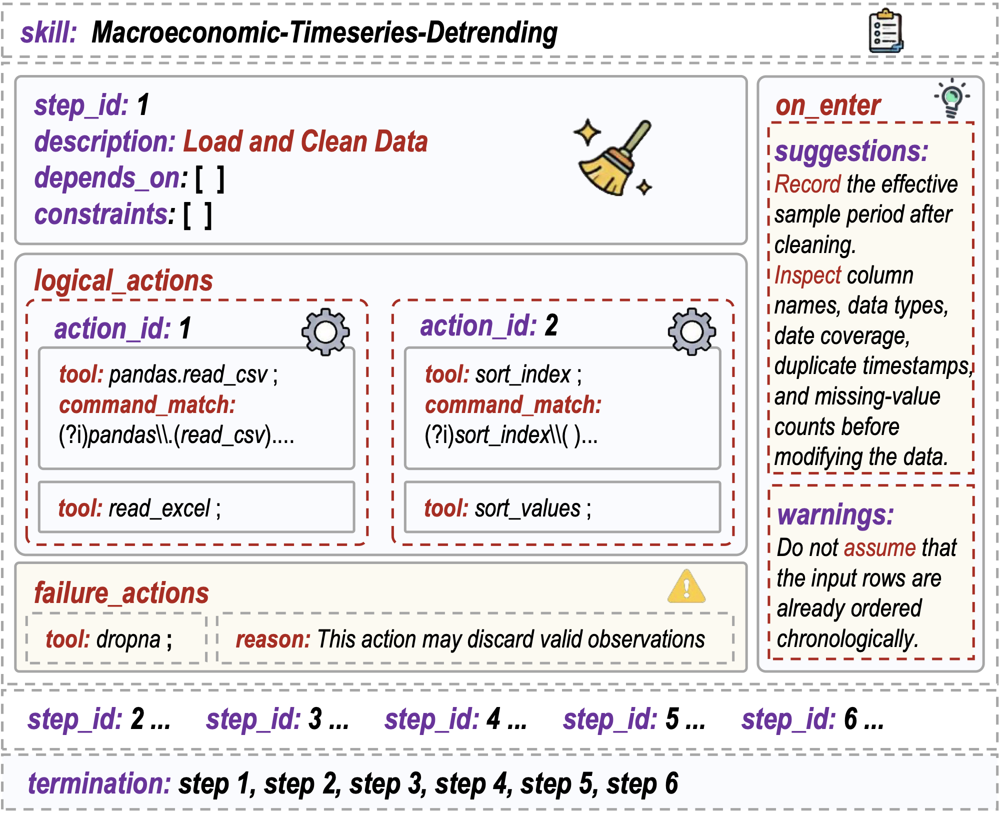</p>

**Example: one step of the guidance.** This is the `analyze_cyclical_component` step from `dsl/opus/econ-detrending-correlation/guidance.json`. `logical_actions` determine when the step counts as completed. `failure_patterns` are soft-denied the first time they match, and the stated reason is returned to the agent as a hint. `on_enter` guidance is delivered when the step becomes active.

```json
{
  "stepId": "analyze_cyclical_component",
  "description": "Analyze cyclical component — compute correlation of cycle outputs, not trend",
  "depends_on": ["apply_hp_filter"],
  "logical_actions": [
    {"actionId": 1, "patterns": [
      {"tool": "Bash",  "command_match": "corrcoef|pearsonr|correlation|spearman|\\bcorr\\("},
      {"tool": "Write", "input_match": {"content": "corrcoef|pearsonr|correlation|spearman|\\bcorr\\("}}
    ]}
  ],
  "failure_patterns": [
    {"tool": "Bash",
     "command_match": "corrcoef\\([^)]*\\btrend\\b[^)]*,\\s*[^)]*\\btrend\\b[^)]*\\)",
     "reason": "❌ Error: Do not compute correlation of trends. Use the cyclical component from hpfilter instead."}
  ],
  "on_enter": {
    "suggestions": ["hpfilter returns (cycle, trend) — use cycle for correlation, not trend."]
  }
}
```

**Examples of failure-associated patterns** in the final runtime guidance. These were mined automatically from failed traces.

| Agent-model | Skill / step | Runtime rule (tool + regex) | Stated reason |
|---|---|---|---|
| Codex + GPT-5.4 | glm-calibration / `process_output_and_calc_rmse` | Write, content: `depth\s*=\s*z\b` | ❌ GLM z is height from lake bottom. Correct: depth = lake_depth - z. |
| Claude Code + Opus-4.6 | spring-boot-migration / `update_spring_security` | Write, content: `WebSecurityConfigurerAdapter` | ❌ WebSecurityConfigurerAdapter was removed in Spring Security 6. Use @Bean SecurityFilterChain instead. |
| Claude Code + Haiku-4.5 | pddl-skills / `save_plan` | Write, content: `f\.write\(str\(action\)` | ❌ Using str(action) produces wrong PDDL format 'action(args)' instead of '(action args)'. Use PDDLWriter.write_plan() which generates correct PDDL format. |
| Claude Code + Opus-4.6 | fjsp-repair-with-downtime-and-policy / `implement_overlap_detection` | Write, content: `return.*<=.*and.*<=` | ⚠️ Use half-open intervals [s,e): correct formula is 's < b and a < e'. Using <= incorrectly flags adjacent intervals as overlapping. |
| Claude Code + Opus-4.6 | macroeconomic-timeseries-detrending / `analyze_cyclical_component` | Bash, command: `corrcoef\([^)]*\btrend\b[^)]*,\s*[^)]*\btrend\b[^)]*\)` | ❌ Do not compute correlation of trends. Use the cyclical component from hpfilter instead. |

### Case Study

The figure below shows how SkillSentry assures Claude Code with Claude-Haiku-4.5 while it executes the *macroeconomic-timeseries-detrending* skill.

1. When the agent enters each step, SkillSentry delivers that step's suggestions and warnings.
2. After the data is loaded, the agent tries to go straight to *Convert to Real Terms*, skipping *Harmonize Frequency*. SkillSentry soft-denies the action and returns a hint that names the missing step.
3. The agent re-plans and calls `write_frequency` to aggregate the 2024 quarterly observations, which completes the skipped step.
4. SkillSentry then lets execution continue, and checks that all required steps are completed before it accepts the final output. The result is the expected Pearson correlation of 0.68885.

<p align="center">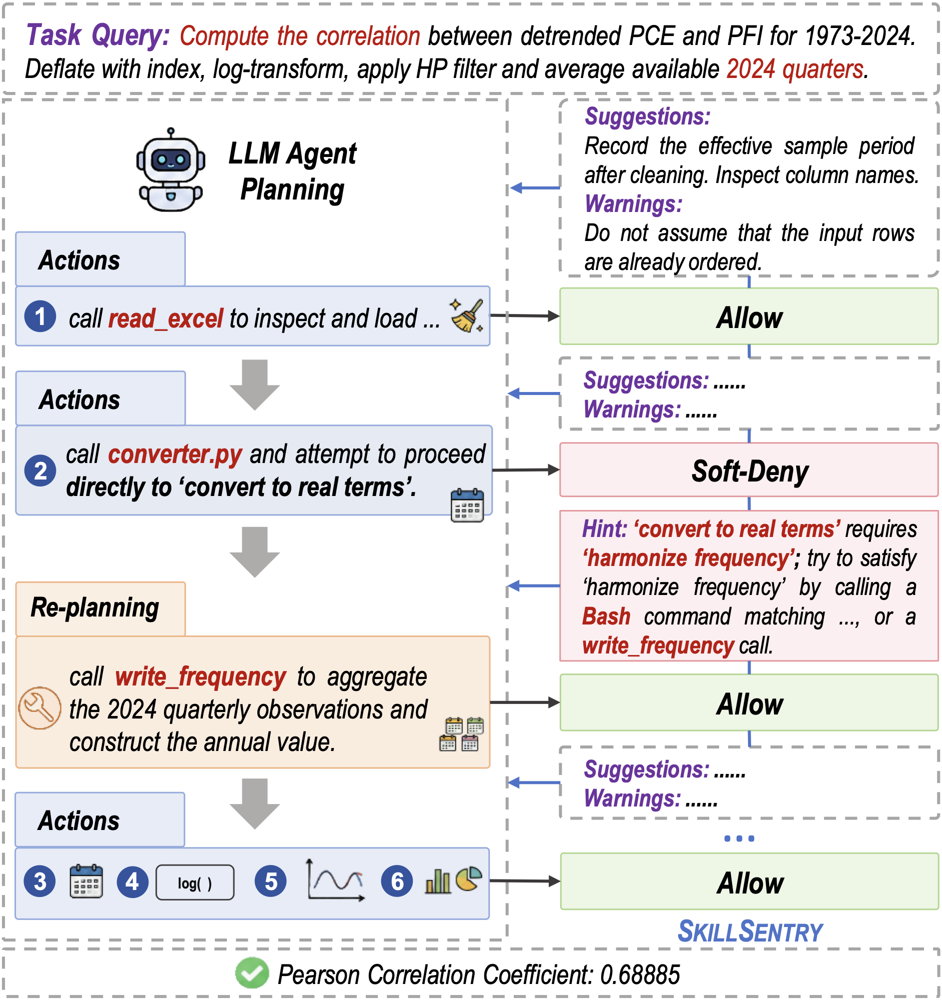</p>

### Self-Evolving Success Rate Curves (`data/results/evolve/`)

Per-skill success rate over 10 self-evolving iterations for each model. Each PNG shows the baseline (iteration 1, guidance skeleton only) versus the evolving trajectory.

| | Claude-Haiku-4.5 | Claude-Opus-4.6 | GPT-5.2-medium | GPT-5.4 |
|---|---|---|---|---|
| Example (econ) | 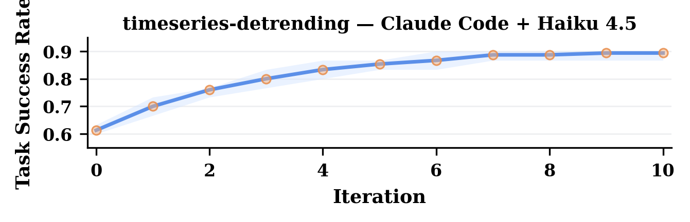 | 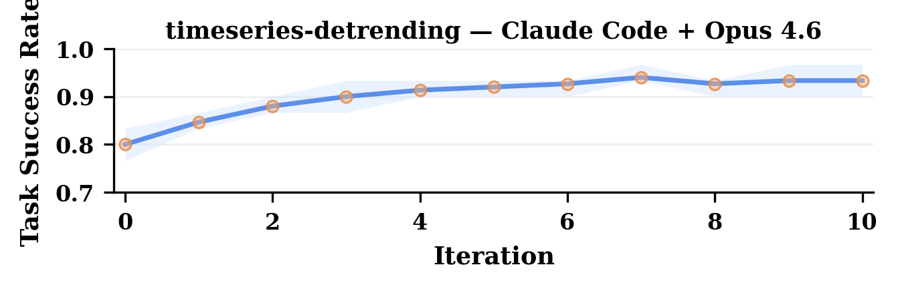 | 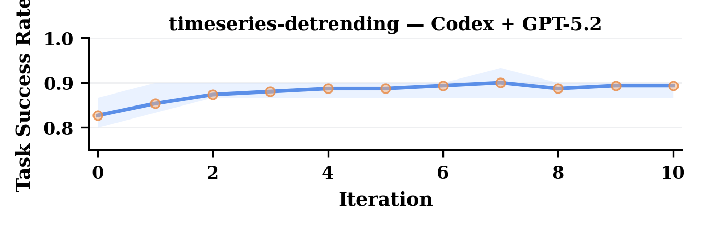 | 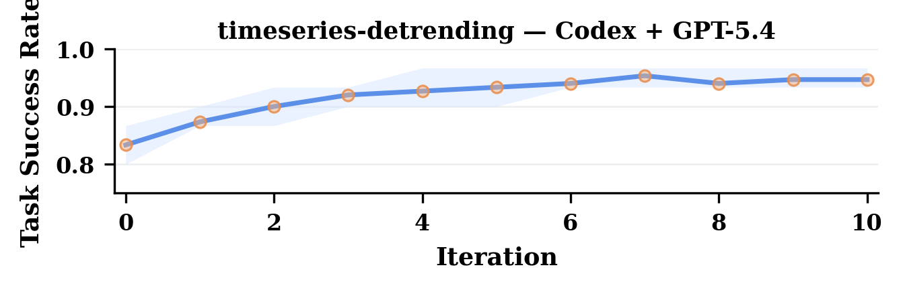 |

All 15 per-skill curves are in the respective subdirectories under `data/results/evolve/`.

### Runtime Overhead (`data/results/runtimes/`)

Breakdown of SkillSentry's runtime overhead (procedure checking, termination checking, experience mining) per model.

| Claude-Haiku-4.5 | Claude-Opus-4.6 | GPT-5.2-medium | GPT-5.4 |
|---|---|---|---|
| 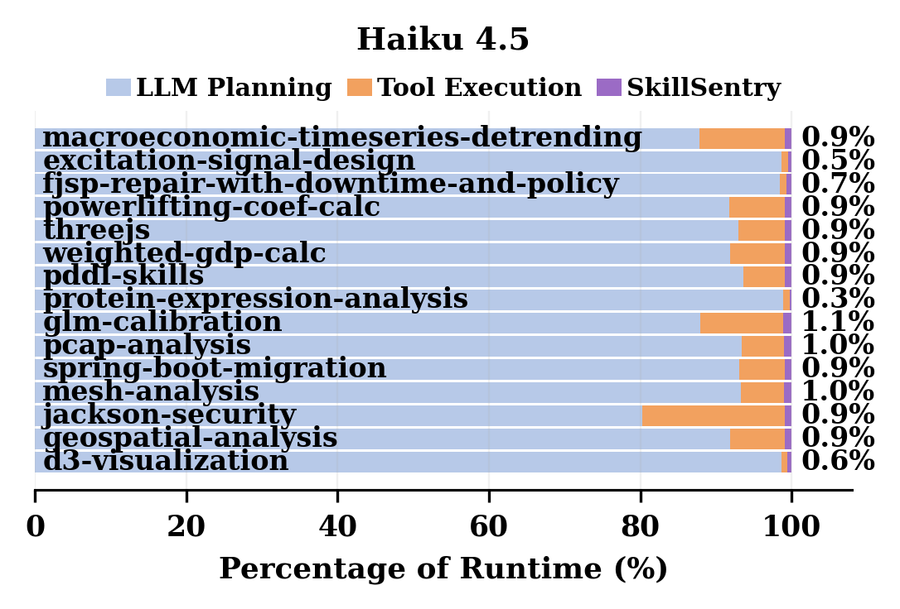 |  | 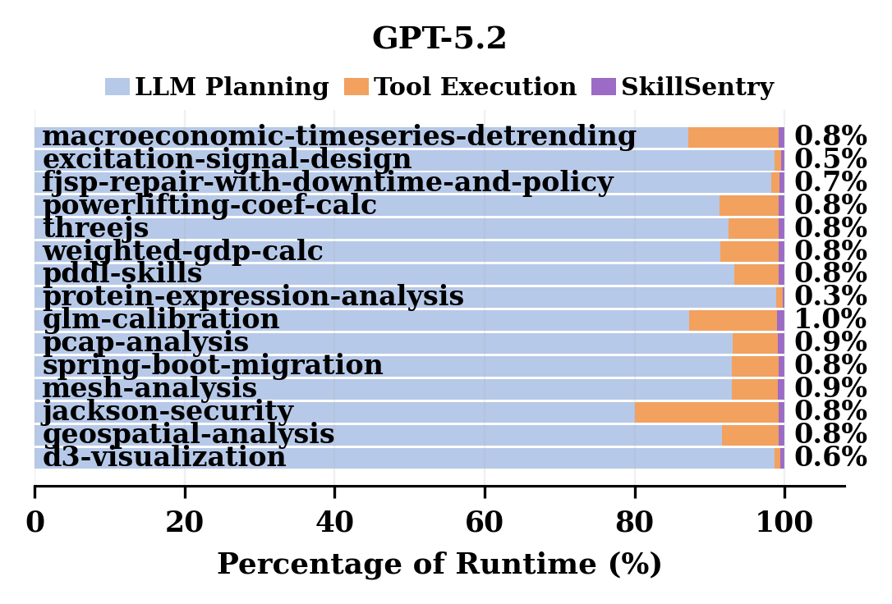 | 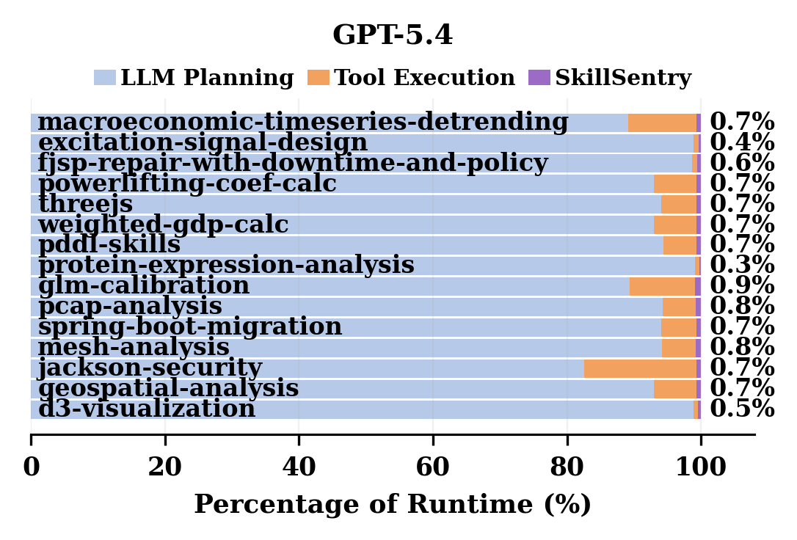 |

### Human Evaluation (`data/human_evaluation/`)

`human_evaluation_questionnaire.xlsx` is the blank questionnaire used to evaluate the quality of the LLM-extracted content. There were two groups of raters, G1 (graduate students) and G2 (authors), and each rater worked independently.

- **Part A: skill specification extraction.** The sheets `A_steps_<n>`, `A_constraints_<n>` and `A_spec_<n>` cover steps, dependencies, constraints and termination steps. These are rated against the full SKILL.md, which is provided in the `doc_<task>` sheets. The criteria are P1 Step fidelity, P2 Dependency correctness, P3 Constraint fidelity, P4 Completeness and P5 Termination correctness. A rating of 3 or lower also records an error type: Omitted, Altered or Hallucinated.
- **Part B: execution experience mining.** The sheets `B_actions_<n>` and `B_suggestions_<n>` cover action patterns and suggestions/warnings. The criteria are D1 Evidence grounding, D2 Step alignment, D3 Reason validity and D4 Rule faithfulness.

Every criterion is rated on a 1–5 scale, from 1 = *Totally not match* to 5 = *Totally match*. The `Instructions` and `How to rate` sheets give the rating rules and the definition of each level.

## Installation

### Prerequisites

- **x86_64 Linux**
- **Docker**
- **Harbor >= 0.1.45**

```bash
uv tool install harbor
```

- **Python 3.10+** with standard packages (`openai`, `anthropic`, or compatible)

### Step 1: Install the Codex hook fix

SkillSentry relies on Codex hooks firing in `exec` mode. Codex 0.135.0 has a bug that silently drops all hooks in non-interactive mode. The patched binary is included in `skillsentry/fix_codex/`.

```bash
cd skillsentry/fix_codex
bash setup.sh
```

This builds the `codex-base:0.135.0` Docker image (~5 min on first run) and registers `PatchedCodexAgent` in Harbor's Python environment.

Verify the setup:

```bash
# Image exists
docker images | grep codex-base

# Binary works inside the image
docker run --rm codex-base:0.135.0 sh -c '. ~/.nvm/nvm.sh && codex --version'

# Python package importable
HARBOR_PYTHON=$(head -1 $(which harbor) | sed 's/^#!//')
$HARBOR_PYTHON -c "from fix_codex.agent import PatchedCodexAgent; print('OK')"
```

### Step 2: Prepare task data

```bash
cd skillsentry-evolve
python utils/prepare_data.py
```

This converts the raw tasks under `data/raw/` into the `data/evolve/<task>/` format expected by the evolve pipeline (80 queries per skill, split at runtime into Q\_evol / Q\_test).

## Running the Self-Evolving Pipeline

All commands are run from the `skillsentry-evolve/` directory.

### Environment variables

| Variable | Description | Example |
|---|---|---|
| `LLM_API_BASE` | API base URL for the guidance LLM (spec extractor / experience miner) | `https://api.example.com/v1` |
| `LLM_API_KEY` / `OPENAI_API_KEY` | API key for the guidance LLM | `sk-xxxxxxxx` |
| `LLM_MODEL` | Model used for guidance generation | `gpt-5.4` |
| `AGENT_API_BASE` | API base URL for the agent running inside Harbor containers | `https://api.example.com/v1` |
| `AGENT_API_KEY` | API key for the agent | `sk-xxxxxxxx` |
| `HARBOR_MODEL` | Model used by the Harbor agent | `gpt-5.4` |
| `HARBOR_AGENT` | Harbor agent type (`claude-code` or `codex`) | `claude-code` |
| `TASKS_ROOT` | Path to raw task environments | `data/raw/skillsentry_tasks` |
| `EVOLVE_ROOT` | Path to prepared query splits | `data/evolve` |
| `OUTPUT_DIR` | Output directory for evolved guidance and traces | `data/results/evolve` |
| `RULES_REF_DIR` | Directory containing initial DSL guidance skeletons | `data/results/dsl` |

Export before running:

```bash
export LLM_API_BASE="https://api.example.com/v1"
export LLM_API_KEY="sk-xxxxxxxx"
export OPENAI_API_KEY="sk-xxxxxxxx"
export LLM_MODEL="gpt-5.4"

export AGENT_API_BASE="https://api.example.com/v1"
export AGENT_API_KEY="sk-xxxxxxxx"
export HARBOR_MODEL="gpt-5.4"
export HARBOR_AGENT="claude-code"
```

### Stage 1 — Initialization

Extracts a DSL guidance skeleton from the skill document (SKILL.md). No agent traces needed.

```bash
bash run.sh econ-detrending-correlation initialize
```

Or directly:

```bash
python main.py --task econ-detrending-correlation --mode initialize
```

Output: `data/results/evolve/<skill>/guidance.json` (DSL skeleton, experience fields empty)

### Stage 2 — Self-Evolving

Runs the agent on Q\_evol queries, mines execution experience, and updates the guidance iteratively.

```bash
# 10 iterations, 5 queries per iteration (defaults from the paper)
bash run.sh econ-detrending-correlation evolve

# Custom settings
bash run.sh econ-detrending-correlation evolve --iterations 5 --queries-per-iter 3
```

Or directly:

```bash
python main.py --task econ-detrending-correlation --mode evolve --iterations 10 --queries-per-iter 5
```

Output per iteration: `data/results/evolve/<skill>/iter_<N>/guidance.json` and `diff_log.json`

## License

Apache License 2.0. See [LICENSE](LICENSE).
